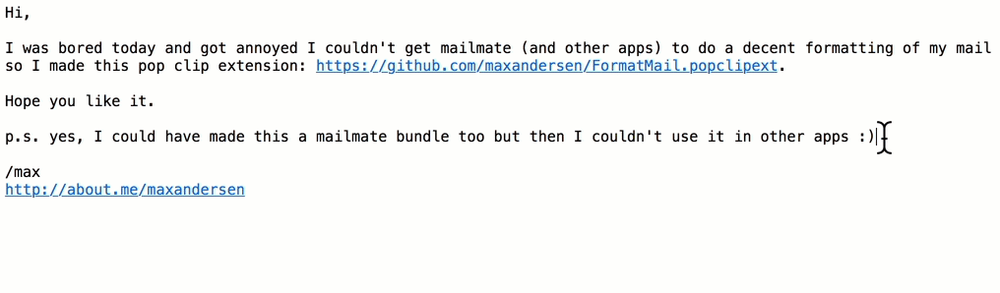

Format Mail 
===========

Format Mail extension for PopClip.

Intended use is to format paragraphs to be more readable in mails
by reformatting it so no text goes beyond 79 characters - and without
breaking up common text formatting like markdown or asciidoc.



Installation
============

1) Have [PopClip](http://pilotmoon.com/popclip/) installed
2) Have [par]((http://www.nicemice.net/par/)) installed (`brew install par`)
2) Cl and open this repository

```
git clone https://github.com/maxandersen/FormatMail.popclipext
open FormatMail.popclipext
```

Acknowledgments
===============

Inspired by this [blog](https://dlukes.github.io/fill-par-in-airmail.html) by [dlukes](https://github.com/dlukes)

Uses a font-awesome free icon under its [Creative Commons Attribution 4.0 International license](https://fontawesome.com/license/free).


